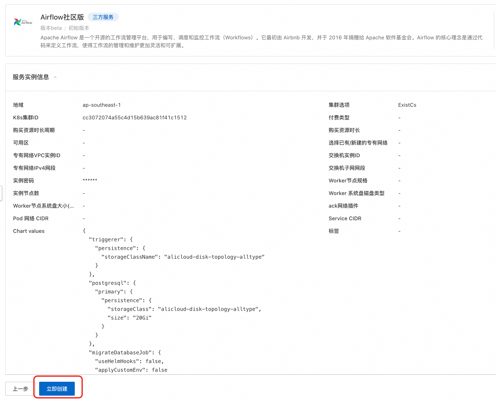

# Airflow Quick Deployment on Compute Nest

>**Disclaimer:** This service is provided by a third party. We strive to ensure its security, accuracy, and reliability but cannot guarantee it is entirely free from faults, interruptions, errors, or attacks. Therefore, our company hereby states: we make no representations, warranties, or guarantees regarding the content, accuracy, completeness, reliability, suitability, or timeliness of this service. We assume no liability for any direct or indirect losses or damages arising from your use of this service. We are not responsible for the content, accuracy, completeness, reliability, suitability, or timeliness of any third-party websites, applications, products, or services accessed through this service. You are solely responsible for the risks and consequences associated with their use. We are not liable for any losses or damages caused by your use of this service, including but not limited to direct losses, indirect losses, lost profits, loss of goodwill, data loss, or other economic losses, even if we were previously informed of the possibility of such losses or damages. We reserve the right to modify this statement at any time. Please review this statement regularly before using the service. If you have any questions or concerns about this statement or the service, please contact us.

## Overview

Apache Airflow is an open-source workflow management platform used to author, schedule, and monitor workflows (Workflows). It was initially developed by Airbnb and donated to the Apache Software Foundation in 2016. The core concept of Airflow is defining workflows through code, making workflow management and maintenance more flexible and scalable. For the GitHub community page, see [link](https://github.com/apache/airflow).

## Billing Information

The costs of deploying Airflow mainly involve:

- Selected vCPU and memory specifications
- System disk type and capacity
- Public network bandwidth
- Kubernetes cluster specifications

## Deployment Architecture

## Parameter Description

| Parameter Group   | Parameter Item      | Description                                                                 |
|-------------------|---------------------|-----------------------------------------------------------------------------|
| Service Instance  | Service Instance Name | No longer than 64 characters, must start with an English letter, and can contain numbers, letters, hyphens (-), and underscores (_) |
|                   | Region              | The region where the service instance is deployed                                           |
| Container Cluster Options | Cluster Option    | Whether to create a new cluster or use an existing one                                      |
| Billing Configuration | Billing Type      | Resource billing type: Pay-as-you-go or Subscription                                       |
| Kubernetes Configuration | Worker Node Specifications | ACK cluster node specifications                                                     |
|                   | Number of Instance Nodes | Number of ACK cluster nodes                                                       |
|                   | Worker System Disk Type | ACK cluster node mounted system disk type                                            |
|                   | Worker Node System Disk Size (GB) | ACK cluster node mounted system disk size                                            |
|                   | ACK Network Plugin  | Flannel or Terway                                                            |
|                   | Service CIDR       | Must not overlap with the VPC or the network segments used by existing Kubernetes clusters within the VPC. Cannot be modified after creation |
| Helm Configuration | Chart Values       | Content of Helm deployment parameters                                                |
| Basic Configuration | Availability Zone | Availability zone where the nodes are deployed                                             |
|                   | Select Existing/New VPC | The VPC where resources are located                                                 |
|                   | VPC IPv4 Segment   | Professional network IPv4 segment                                                    |
|                   | Subnet Segment     | Must belong to the VPC subnet segment.                                               |

## Required Permissions for RAM Accounts

To deploy Airflow, access and creation operations for certain Alibaba Cloud resources are required. Therefore, your account needs to include permissions for the following resources.
**Note**: These permissions are only required when your account is a RAM account.

| Permission Policy Name                  | Remarks                                |
|-----------------------------------------|----------------------------------------|
| AliyunECSFullAccess                     | Permissions to manage Elastic Compute Service (ECS)         |
| AliyunVPCFullAccess                     | Permissions to manage Virtual Private Cloud (VPC)           |
| AliyunROSFullAccess                     | Permissions to manage Resource Orchestration Service (ROS)  |
| AliyunComputeNestUserFullAccess         | User-side permissions for Compute Nest service             |
| AliyunPostGreSQLFullAccess              | Permissions to manage cloud database service (PostgreSQL)   |
| AliyunSLBFullAccess                     | Permissions to manage Server Load Balancer (SLB)           |

## Deployment Process

1. Visit the Airflow service [deployment link](https://computenest.console.aliyun.com/service/instance/create/default?type=user&ServiceName=Airflow%E7%A4%BE%E5%8C%BA%E7%89%88), fill in the deployment parameters as prompted. You can modify the Chart Values according to your needs here:

2. After confirming the order, agree to the service agreement and click **Create Now** to proceed to the deployment phase.

3. In the service instance list, you can view the specific deployment progress of the service instance.

4. After the deployment is complete, find the Airflow service link in the console and access it. The initial username and password are both "admin" by default.

