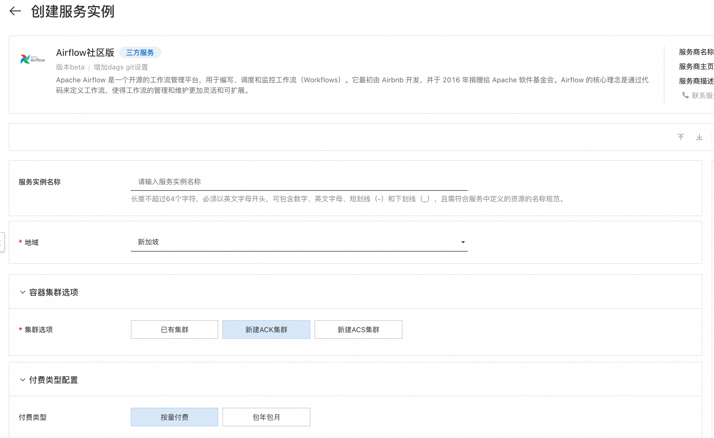
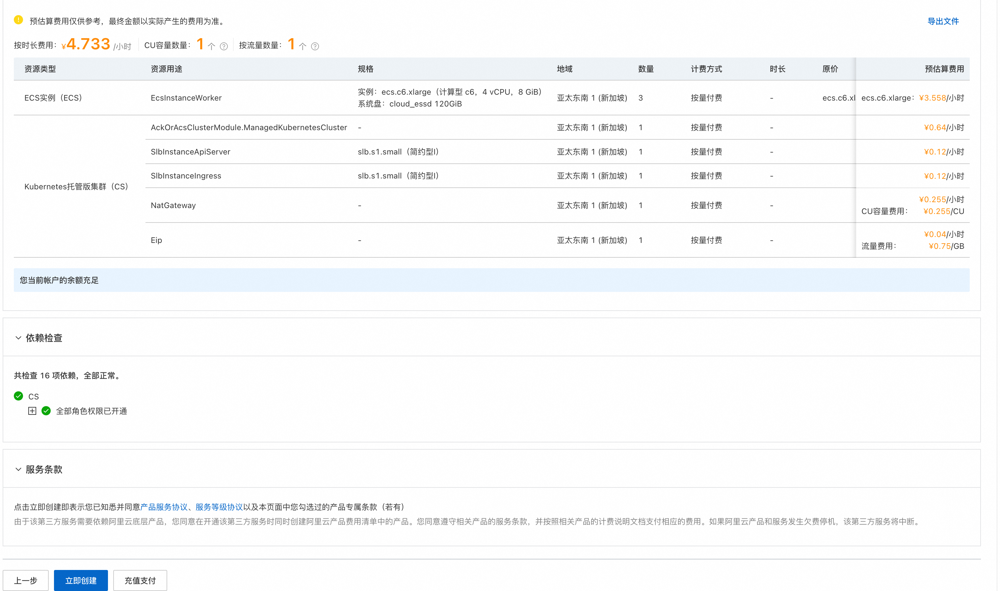
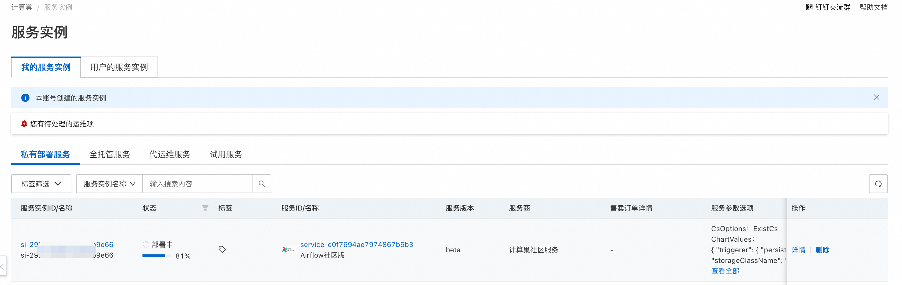
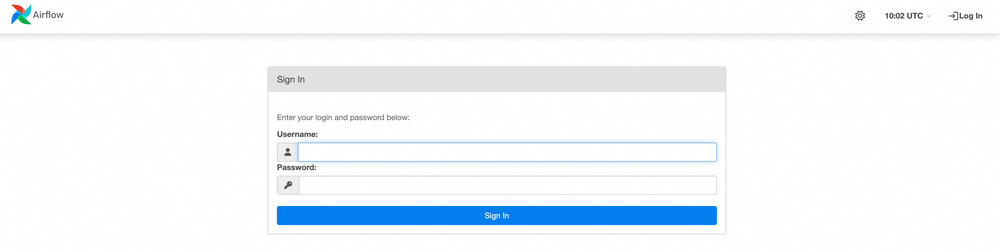
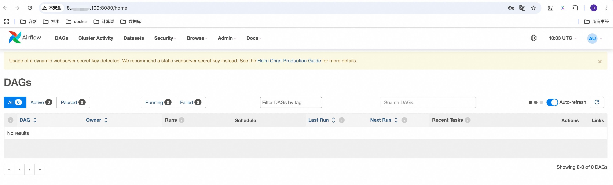
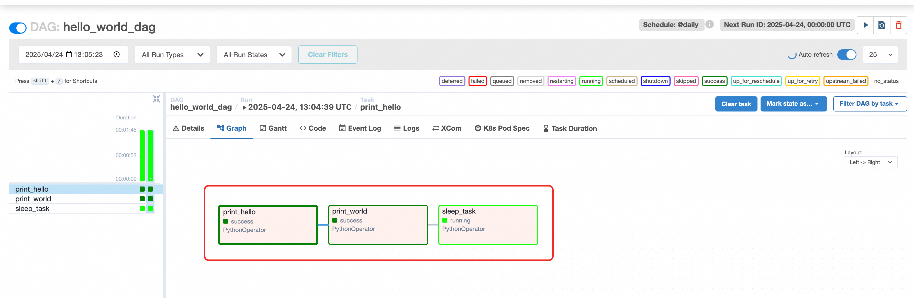

# Quick Deployment of Airflow on ComputeNest

> **Disclaimer:** This service is provided by a third party. We strive to ensure its security, accuracy, and reliability but cannot guarantee it is entirely free from failures, interruptions, errors, or attacks. Therefore, our company hereby disclaims any representations, warranties, or guarantees regarding the content, accuracy, completeness, reliability, suitability, or timeliness of this service. We are not liable for any direct or indirect losses or damages caused by your use of this service. For third-party websites, applications, products, and services accessed through this service, we assume no responsibility for their content, accuracy, completeness, reliability, suitability, or timeliness. You bear all risks and responsibilities arising from the consequences of using this service. We are not liable for any losses or damages, including but not limited to direct losses, indirect losses, lost profits, damaged reputation, data loss, or other economic losses, even if we were previously informed of the possibility of such losses or damages. We reserve the right to modify this disclaimer at any time, so please check it regularly before using this service. If you have any questions or concerns about this disclaimer or this service, please contact us.

## Overview

Apache Airflow is an open-source workflow management platform used for writing, scheduling, and monitoring workflows. It was initially developed by Airbnb and donated to the Apache Software Foundation in 2016. The core idea of Airflow is to define workflows through code, making workflow management and maintenance more flexible and scalable. For the GitHub community page, see [link](https://github.com/apache/airflow).

## Billing Information

The cost of deploying Airflow primarily involves:

- Selected vCPU and memory specifications
- System disk type and capacity
- Public network bandwidth
- Kubernetes cluster specifications

## Deployment Architecture


## Required Permissions for RAM Accounts

Deploying Airflow requires access and creation operations for certain Alibaba Cloud resources. Therefore, your account needs to include permissions for the following resources:
**Note**: These permissions are required only if your account is a RAM account.

| Permission Policy Name                  | Remarks                                 |
|-----------------------------------------|-----------------------------------------|
| AliyunECSFullAccess                     | Full access to manage Elastic Compute Service (ECS) |
| AliyunVPCFullAccess                     | Full access to manage Virtual Private Cloud (VPC) |
| AliyunROSFullAccess                     | Full access to manage Resource Orchestration Service (ROS) |
| AliyunComputeNestUserFullAccess         | User-side permissions for ComputeNest service |
| AliyunPostGreSQLFullAccess              | Full access to manage PostgreSQL database services |
| AliyunSLBFullAccess                     | Full access to manage Server Load Balancer (SLB) |

## Deployment Process

1. Visit the Airflow service [deployment link](https://computenest.console.aliyun.com/service/instance/create/default?type=user&ServiceName=Airflow%E7%A4%BE%E5%8C%BA%E7%89%88), and fill in the deployment parameters as prompted. First, set up the container cluster. You can choose to create a new container cluster or deploy to an existing one. Here, we will deploy a new ACK cluster and input the required parameters for creating the ACK cluster:




2. Next, configure the Git repository that will store DAG files. This service uses a Git repository to store DAG files.
   

3. Set the username and password for Airflow web login.
   

4. Configure the network settings for the ACK cluster deployment. You can choose an existing VPC and VSwitch or create a new one.
   

5. After confirming the order, agree to the service agreement and click **Create Now** to proceed to the deployment phase.



6. In the service instance list, you can view the specific deployment progress of the service instance.



7. After the deployment is complete, locate the Airflow service link in the console and access it. The initial username and password are the values set during service instance creation.





## How to Use
Once the service instance has been deployed, how do we run our defined DAG workflows? This mainly relies on the Git repository for synchronization.
We can commit the written DAG files to the Git repository prepared during the creation of the service instance. Then, the `airflow-scheduler` component will synchronize them. On the web interface, you will see the defined DAG files, and you can click the "Run" button to execute the DAG file.

Below is an example of a simple DAG file to demonstrate how to run a DAG in Airflow.

1. Create a DAG file in the Git repository named `hello_world_dag.py`. It contains three tasks that will be executed sequentially:
    - Print "Hello"
    - Print "World"
    - Sleep for 300 seconds
```python
import time
from datetime import timedelta

from airflow import DAG
from airflow.operators.python import PythonOperator
from airflow.utils.dates import days_ago

# Define default arguments
default_args = {
    'owner': 'airflow',              # Owner of the DAG
    'start_date': days_ago(1),       # Start date of the DAG (1 day ago)
    'retries': 1,                    # Number of retries upon task failure
    'retry_delay': timedelta(minutes=5),  # Retry interval
}

# Define the DAG object
with DAG(
    dag_id='hello_world_dag',        # Unique identifier for the DAG
    default_args=default_args,       # Use default arguments
    schedule_interval='@daily',      # Run once daily
    catchup=False,                   # Whether to backfill historical tasks
) as dag:

    # Define the first task: print "Hello"
    def print_hello():
        print("Hello")

    task_hello = PythonOperator(
        task_id='print_hello',        # Unique identifier for the task
        python_callable=print_hello,  # Callable Python function
    )

    # Define the second task: print "World"
    def print_world():
        print("World")

    task_world = PythonOperator(
        task_id='print_world',
        python_callable=print_world,
    )

    # Define a sleep task
    def sleep_task():
        print("Task is sleeping for 300 seconds...")
        time.sleep(300)  # Sleep for 300 seconds
        print("Task woke up!")

    sleep_operator = PythonOperator(
        task_id='sleep_task',
        python_callable=sleep_task,
    )

    # Set task dependencies
    task_hello >> task_world >> sleep_operator
```

2. Commit the DAG file to the Git repository, then check the web interface. You will see the corresponding DAG. Note that there may be a delay in synchronization, which is currently set to occur every 10 seconds.
   

3. Execute the DAG by clicking the "Run" button. You can view the execution record, and by clicking "Graph," you can see the detailed steps of execution. You will notice that `print_hello` and `print_world` have completed execution, while `sleep_task` is still running. This feature is indeed powerful.
   
   

4. Click on the running `sleep_task`, and in the Logs section, you can see the output information, indicating that it will sleep for 300 seconds. This confirms normal execution.
   

From the above example, it is clear that Airflow has robust functionality. You can clearly see the execution status of DAGs, with each step displayed graphically. Execution times and logs are also available, making it highly suitable for workflow management.

## FAQ

1. Git-sync container startup failure
> Due to the need to access the Git repository, domestic machines may not be able to access GitHub. You can choose to deploy in overseas regions. Additionally, note that if the Git repository is private, you must provide an access key. You will need to manually upgrade and modify the deployed Helm release. For configuration details, refer to the [official values.yaml configuration](https://github.com/aliyun-computenest/quickstart-airflow/blob/main/chart/values.yaml).