# Airflow计算巢快速部署

>**免责声明：**本服务由第三方提供，我们尽力确保其安全性、准确性和可靠性，但无法保证其完全免于故障、中断、错误或攻击。因此，本公司在此声明：对于本服务的内容、准确性、完整性、可靠性、适用性以及及时性不作任何陈述、保证或承诺，不对您使用本服务所产生的任何直接或间接的损失或损害承担任何责任；对于您通过本服务访问的第三方网站、应用程序、产品和服务，不对其内容、准确性、完整性、可靠性、适用性以及及时性承担任何责任，您应自行承担使用后果产生的风险和责任；对于因您使用本服务而产生的任何损失、损害，包括但不限于直接损失、间接损失、利润损失、商誉损失、数据损失或其他经济损失，不承担任何责任，即使本公司事先已被告知可能存在此类损失或损害的可能性；我们保留不时修改本声明的权利，因此请您在使用本服务前定期检查本声明。如果您对本声明或本服务存在任何问题或疑问，请联系我们。


## 概述

Apache Airflow 是一个开源的工作流管理平台，用于编写、调度和监控工作流（Workflows）。它最初由 Airbnb 开发，并于 2016 年捐赠给 Apache 软件基金会。Airflow 的核心理念是通过代码来定义工作流，使得工作流的管理和维护更加灵活和可扩展, github社区地址见[链接](https://github.com/apache/airflow)。

## 计费说明

部署Airflow的费用主要涉及：

- 所选vCPU与内存规格
- 系统盘类型及容量
- 公网带宽
- Kubernetes集群规格

## 部署架构

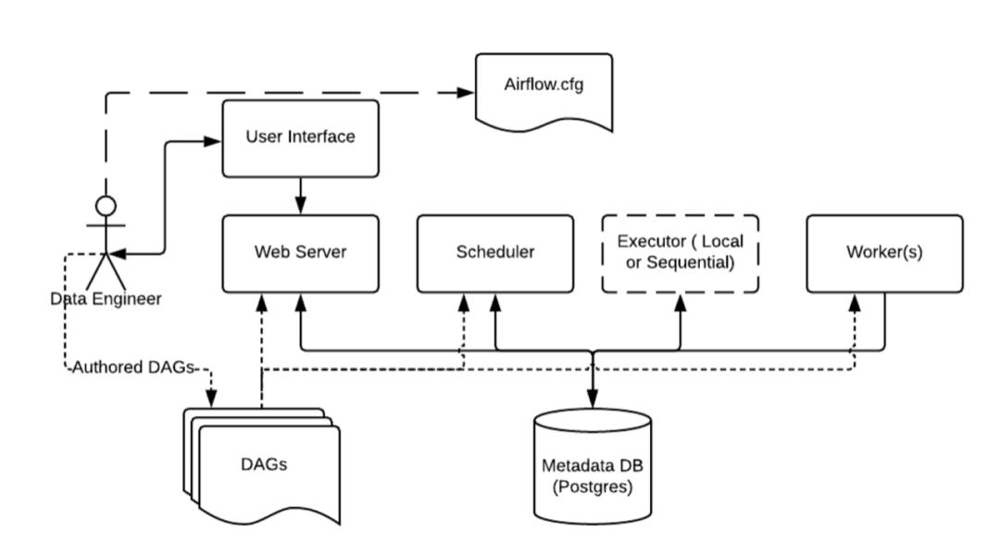

## RAM账号所需权限

部署Airflow，需要对部分阿里云资源进行访问和创建操作。因此您的账号需要包含如下资源的权限。
  **说明**：当您的账号是RAM账号时，才需要添加此权限。

| 权限策略名称                          | 备注                                 |
|---------------------------------|------------------------------------|
| AliyunECSFullAccess             | 管理云服务器服务（ECS）的权限                   |
| AliyunVPCFullAccess             | 管理专有网络（VPC）的权限                     |
| AliyunROSFullAccess             | 管理资源编排服务（ROS）的权限                   |
| AliyunComputeNestUserFullAccess | 管理计算巢服务（ComputeNest）的用户侧权限         |
| AliyunPostGreSQLFullAccess      | 管理云数据库服务（PostGreSQL）的权限            |
| AliyunSLBFullAccess             | 管理负载均衡（SLB）的权限                     |

## 部署流程

1.访问Airflow服务[部署链接](https://computenest.console.aliyun.com/service/instance/create/default?type=user&ServiceName=Airflow%E7%A4%BE%E5%8C%BA%E7%89%88)
，按提示填写部署参数, 这里先进行容器集群设置，可以选择创建容器集群，也支持已有集群部署，这里新建ACK集群部署, 填入新建ACK集群所需的参数：

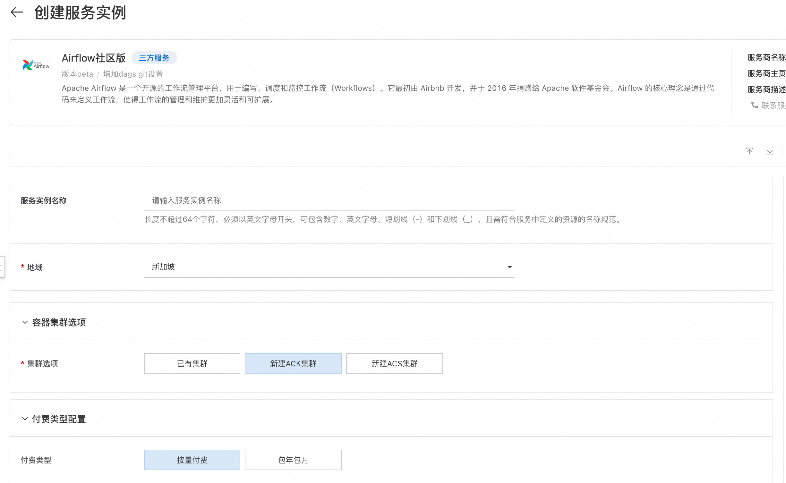
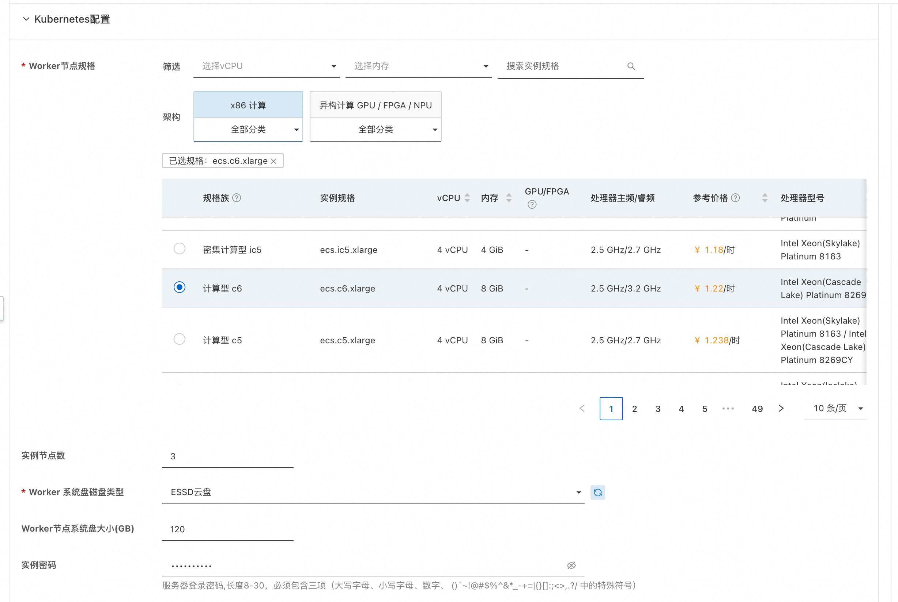

2.然后设置存放DAG文件的Git仓库配置，本服务采用Git仓库保存DAG文件的方式。
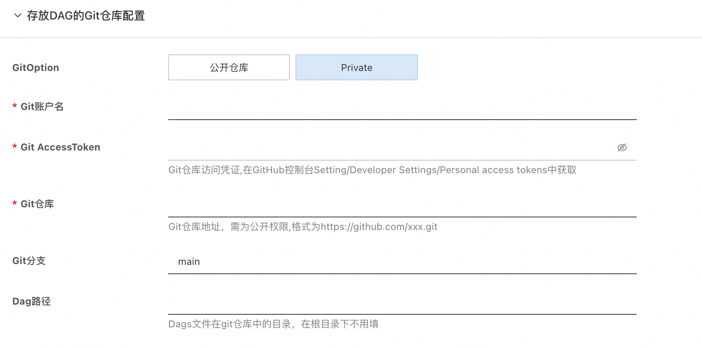

3.设置airflow web登录的账号和密码。


4.设置ACK集群部署的网络设置，这里可以选择已有的Vpc和VSwitch，也可以选择新建Vpc和VSwitch。
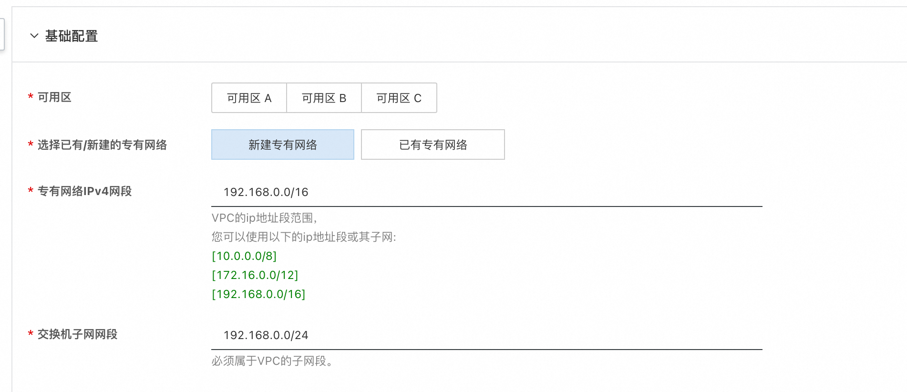

5.确认订单完成后同意服务协议并点击**立即创建**进入部署阶段。

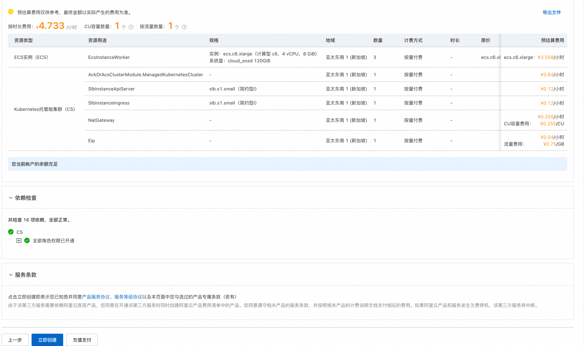

6.在服务实例列表中可以看到服务实例具体部署进度。

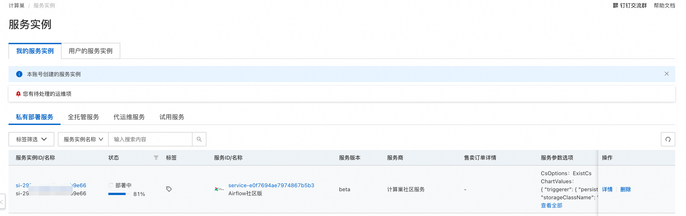

7.部署完成后在控制台找到Airflow服务链接并访问, 初始账号、密码为创建服务实例设置的值。

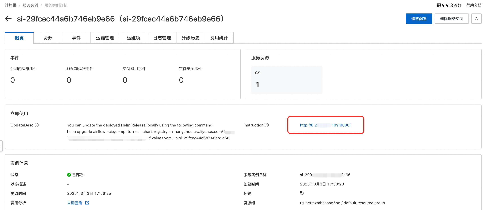

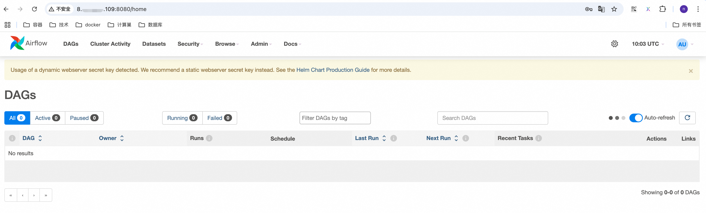

## 使用方式
上面服务实例已经部署完成，那么怎么运行我们定义好的DAG工作流呢，这里主要依赖git仓库去做同步，
我们可以把写好的DAG文件提交到创建服务实例时所准备的git仓库中，然后airflow-scheduler组件会进行同步，
web上就能看到我们定义好的DAG文件，然后点击run按钮就可以运行DAG文件了。

下面以一个简单的DAG文件为例，展示如何在airflow中进行运行DAG。

1.在git仓库中创建DAG文件，文件名为`hello_world_dag.py`，里面有三个任务，会依次执行：
- 打印"Hello"
- 打印"World"
- 休眠300秒
```python
import time
from datetime import timedelta

from airflow import DAG
from airflow.operators.python import PythonOperator
from airflow.utils.dates import days_ago

# 定义默认参数
default_args = {
    'owner': 'airflow',              # DAG 的所有者
    'start_date': days_ago(1),       # DAG 的开始时间（1 天前）
    'retries': 1,                    # 任务失败时的重试次数
    'retry_delay': timedelta(minutes=5),  # 重试间隔
}

# 定义 DAG 对象
with DAG(
    dag_id='hello_world_dag',        # DAG 的唯一标识符
    default_args=default_args,       # 使用默认参数
    schedule_interval='@daily',      # 每天运行一次
    catchup=False,                   # 是否补跑历史任务
) as dag:

    # 定义第一个任务：打印 "Hello"
    def print_hello():
        print("Hello")

    task_hello = PythonOperator(
        task_id='print_hello',        # 任务的唯一标识符
        python_callable=print_hello,  # 调用的 Python 函数
    )

    # 定义第二个任务：打印 "World"
    def print_world():
        print("World")

    task_world = PythonOperator(
        task_id='print_world',
        python_callable=print_world,
    )

    # 定义一个休眠任务
    def sleep_task():
        print("Task is sleeping for 300 seconds...")
        time.sleep(300)  # 休眠 300 秒
        print("Task woke up!")

    sleep_operator = PythonOperator(
        task_id='sleep_task',
        python_callable=sleep_task,
    )

    # 设置任务依赖关系
    task_hello >> task_world >> sleep_operator
```
2.提交DAG文件到git仓库中，然后去web端查看，可以看到对应的DAG，这个过程会有延时，目前设置的是每10s同步一次。
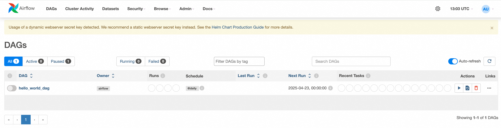

3.执行这个DAG，点击run按钮，点击进行，可以看到执行记录，点击Graph, 可以看到具体执行步骤，
可以看到print_hello和print_world都已经执行完了，sleep_task还在执行中，这个功能确实很强大。
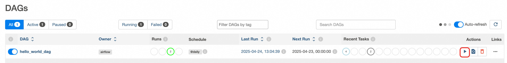
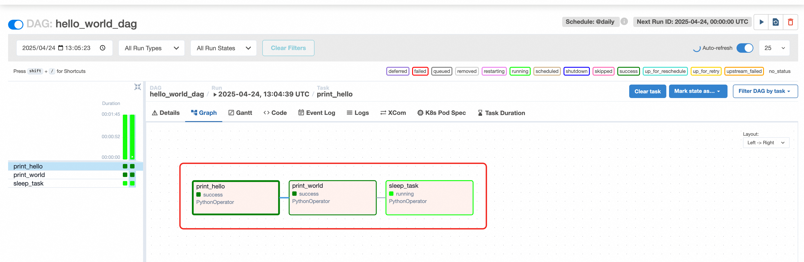
4.点击还在执行中的sleep_task，可以在Logs里看到输出信息，里面输出了会sleep 300秒，可见在正常执行。
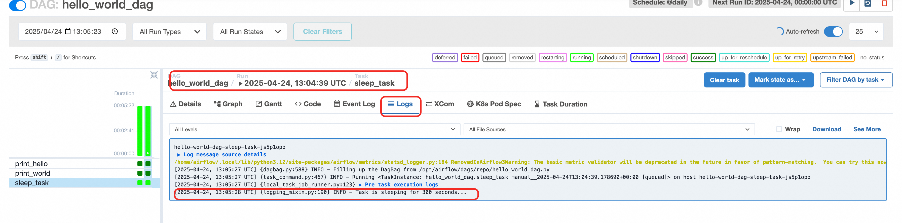

通过上面这个实例，可以看出airflow整体功能还是很强大的，可以清楚的看到DAG的执行情况，并且将每一步的
执行过程都以图形化的方式显示出来，里面还有执行时间和日志，用来做工作流还是很好用的。

## 常见问题答疑
1.git-sync容器启动失败
> 由于需要访问git仓库，国内机器可能无法访问github，可以选择海外地域进行部署，同时也要注意，git仓库非公开
> 的情况下，需要提供访问秘钥，需要自行对部署的helm release进行升级修改，具体配置方式可以参考
> [官方values.yaml配置](https://github.com/aliyun-computenest/quickstart-airflow/blob/main/chart/values.yaml)。

